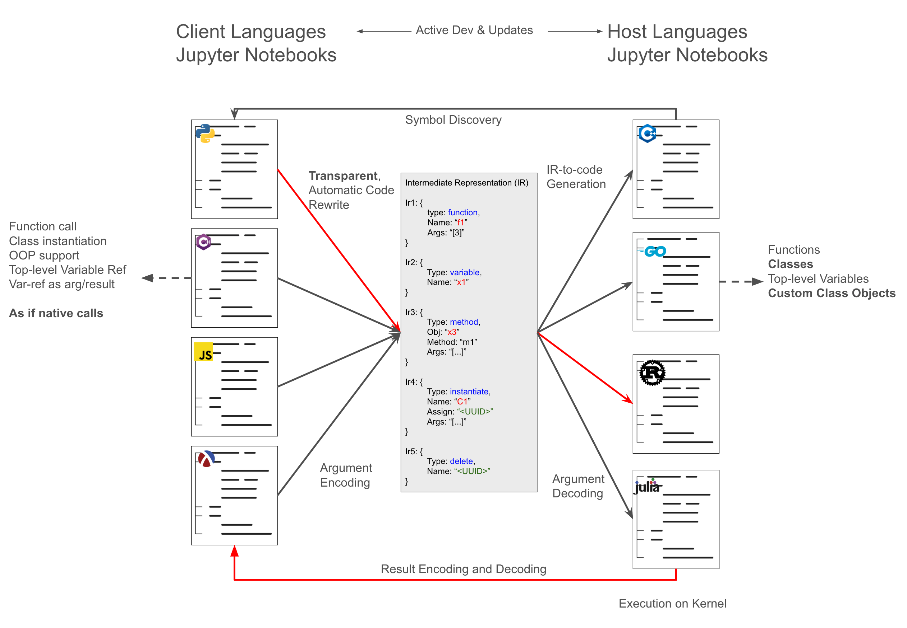
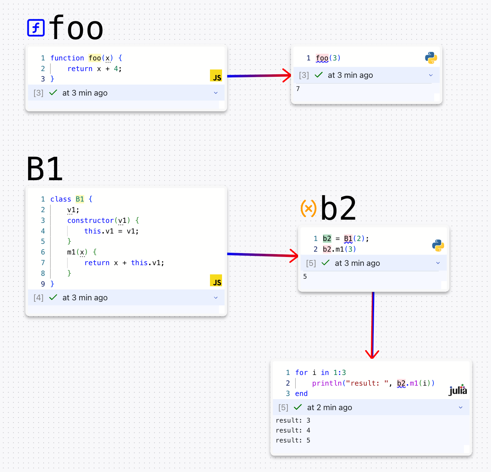
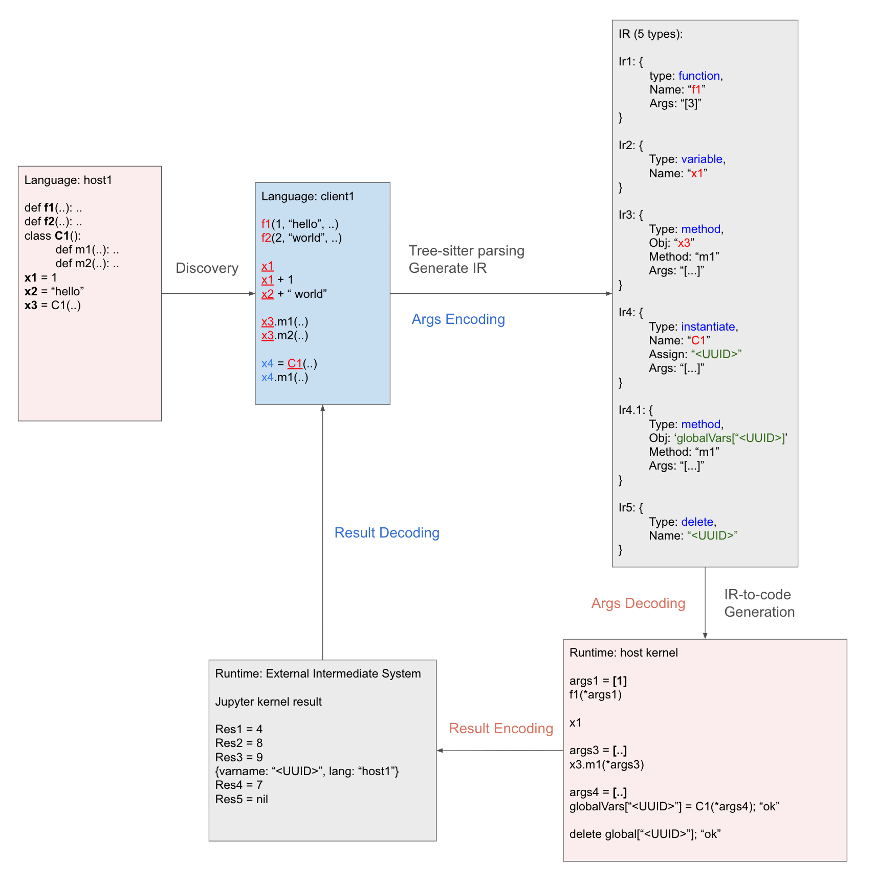
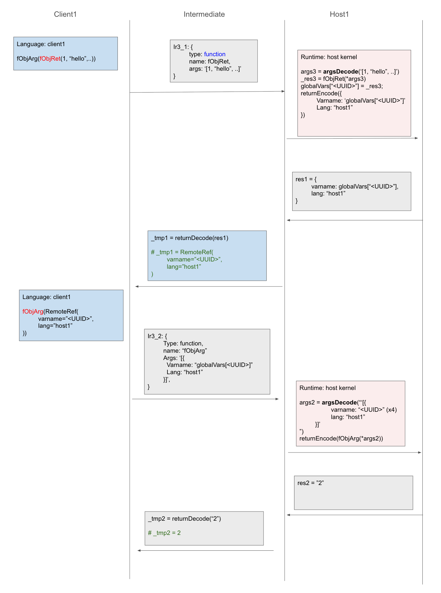

# Kernel-FFI

## Overview

Kernel-FFI is a transparent, language-agnostic framework that enables seamless cross-language function calls and object manipulation within interactive notebooks. It allows you to call functions, access variables, and work with objects across different programming languages as if they were native to your current language.



For technical details, please refer to the following paper:
Hebi Li, Forrest Sheng Bao, Qi Xiao, and Jin Tian. *"Kernel-FFI: Transparent Foreign Function Interfaces for Interactive Notebooks"*, arXiv preprint arXiv:2507.23205 (2025) https://arxiv.org/abs/2507.23205

## What is Kernel-FFI?

Kernel-FFI solves the challenge of multi-language development in interactive environments like Jupyter Notebooks. Traditional approaches require extensive manual configuration, boilerplate code, and often lack support for modern programming constructs like object-oriented programming and recursive calls.

### Key Features

- **Transparent Cross-Language Calls**: Call functions in other languages as if they were native
- **Object-Oriented Programming Support**: Create and manipulate objects across language boundaries
- **No Boilerplate Code**: Automatic source-level transformation eliminates manual bindings
- **Interactive Development**: Works seamlessly with Jupyter's dynamic, exploratory programming model
- **Language Agnostic**: Supports multiple programming languages with different paradigms

## Supported Languages

Kernel-FFI supports a wide range of programming languages:

### Dynamic Languages
- **Python**: Data science, machine learning, web development
- **JavaScript/TypeScript**: Web frontend/backend, Node.js applications
- **Julia**: Scientific computing, multiple dispatch
- **Ruby**: Web development (Rails), metaprogramming
- **Racket**: Functional programming, DSLs

### Static Languages
- **Rust**: Memory safety, systems programming
- **Go**: Cloud services, microservices
- **C++**: Systems programming, performance-critical applications
- **C#**: .NET ecosystem, Windows development

## Usage in CodePod

Kernel-FFI can be directly used in CodePod. Just create pods of different languages, and call each other as if they are native!

<!--  -->


## How It Works

<!--  -->


### 1. Automatic Discovery
Kernel-FFI automatically discovers and maintains a registry of programming constructs (functions, classes, variables) defined in each kernel. As you add, modify, or remove code, the registry updates to reflect the current state.

### 2. Transparent Transformation
When you use a function or object from another language, Kernel-FFI automatically transforms your code into an intermediate representation that can be executed across language boundaries.

### 3. Seamless Execution
The transformed code is executed in the target language kernel, and results are automatically converted back to your native language format.

## Remote Object Reference

<!--  -->


## Advanced Features

### Object-Oriented Programming
Kernel-FFI supports full OOP across languages:

- **Object Instantiation**: Create objects in one language and use them in another
- **Method Calls**: Call methods on foreign objects transparently
- **State Management**: Maintain object state across language boundaries
- **Automatic Cleanup**: Resources are automatically managed

### Recursive Calls
Support for complex multi-language workflows:

- **Non-blocking Communication**: Side-channel communication prevents blocking
- **Recursive Function Calls**: Functions can call back to other languages
- **Asynchronous Support**: Handle async operations across languages

### Type Safety
Maintains type safety across different language paradigms:

- **Dynamic Languages**: Runtime type checking and conversion
- **Static Languages**: Compile-time type information preservation
- **Automatic Serialization**: Handles complex data structures

## Architecture

Kernel-FFI uses a three-layer architecture:

1. **Source Analysis**: Parses and identifies cross-language usage patterns
2. **Intermediate Representation**: Converts operations to language-agnostic format
3. **Target Execution**: Generates and executes code in target languages

### Communication Model
- **Jupyter Protocol**: Leverages existing Jupyter messaging
- **Side-Channel**: HTTP-based communication for non-blocking operations
- **Object Store**: Global registry for managing cross-language objects


## Client and Host examples

### Python

```py

# Python


def foo(x):
    return x+1

a1 = 23

class B1:
    def __init__(self, v1):
        self.v1 = v1
    def m1(self, v2):
        return self.v1 + v2

b1 = B1(4)
b1.m1(3)

def fObjArg(x):
    return x.v1 + 1

def fObjRet(x):
    return B1(x)


# ------------------------------------------------------
# Client code
# ------------------------------------------------------

foo(3) + 1
a1 + 1
b1.m1(9)

b2 = B1(5)
b2.m1(8)

fObjArg(b2)
fObjArg(b1)
fObjArg(fObjRet(3))


```

### C++

```cpp


int foo(int x) {
    return x + 1;
}
int a1 = 23;
class B1 {
private:
    int v1;
public:
    B1(int v) : v1(v) {}
    int m1(int v2) {
        return v1 + v2;
    }
};
B1 b1(4);
b1.m1(3);
int fObjArg(B1 x) {
    return x.m1(0) + 1;
}
B1 fObjRet(int x) {
    return B1(x);
}


// ------------------------------------------------------
// Client for paper
// ------------------------------------------------------

foo(3).get<int>() + 1
a1.get<int>() + 1
b1.m1(2).get<int>() + 1

auto b2 = B1(3)
b2.call("m1")(8)

fObjArg(b1)
fObjArg(b2)
fObjArg(fObjRet(3))


```

### C#

```csharp


int foo(int x) {
    return x + 1;
}
int a1 = 23;
class B1 {
    private int v1;
    public B1(int v1) {
        this.v1 = v1;
    }
    public int m1(int v2) {
        return v1 + v2;
    }
}
var b1 = new B1(4);
b1.m1(9);
int fObjArg(B1 x) {
    return x.m1(0) + 1;
}
dynamic fObjRet(int x) {
    return new B1(x);
}


// ------------------------------------------------------
// Client code
// ------------------------------------------------------

foo(3)
a1 + 1
b1.m1(9)

var b2 = new B1(5);
b2.m1(8)

fObjArg(b2)
fObjArg(b1)
fObjArg(fObjRet(3))


```

### Go

```go


func foo(x int) int {
	return x + 1
}
var a1 = 23

type B1 struct {
	v1 int
}
func (b *B1) m1(v2 int) int {
	return b.v1 + v2
}

b1 := B1{v1: 4}
b1.m1(3)

func fObjArg(x B1) int {
	return x.v1 + 1
}
func fObjRet(x int) B1 {
	return B1{v1: x}
}

// ------------------------------------------------------
// Client code for paper
// ------------------------------------------------------

foo(3)
foo(3).(float64) + 1
a1
a1.(float64) + 1
b1.m1(3)
b2,err := B1(5)
b2.Method("m1")(5)

fObjArg(b2)
fObjArg(b1)
fObjArg(fObjRet(3))


```

### Julia

```julia


function foo(x)
    return x+5
end
a1 = 23

mutable struct B1
    v1::Int
end
b1 = B1(12)
function m1(b::B1, v2)
    return b.v1 + v2
end
b1 = B1(4)
m1(b1, 3)

function fObjArg(x::B1)
    return x.v1 + 1
end
function fObjRet(x)
    return B1(x)
end

# ------------------------------------------------------
# Client code
# ------------------------------------------------------

foo(3)
a1 + 8
b1.m1(9)

b2 = B1(8)
b2.m1(9)

fObjArg(b2)
fObjArg(b1)
fObjArg(fObjRet(3))

```

### Ruby

```rb
# ------------------------------------------------------
# Host code
# ------------------------------------------------------

def foo(x)
  x + 1
end
a1 = 23
class B1
  def initialize(v1)
    @v1 = v1
  end

  def m1(v2)
    @v1 + v2
  end
end
b1 = B1.new(4)
b1.m1(3)
def fObjArg(x)
  x.m1(0) + 1
end
def fObjRet(x)
  B1.new(x)
end

# ------------------------------------------------------
# Client code
# ------------------------------------------------------


foo(3)
a1
b1.m1(4)

b2 = B1(5)
b2.m1(3)

fObjArg(b2)
fObjArg(b1)
fObjArg(fObjRet(3))

```

### Racket

```scheme

(define-syntax (define-class stx)
  (syntax-case stx ()
    [(_ class-name (fields ...) body ...)
     (with-syntax ([make-name (datum->syntax #'class-name
                                             (string->symbol
                                              (format "make-~a" (syntax-e #'class-name))))])
       #'(begin
           (define class-name
             (class object%
               (init-field fields ...)
               (super-new)
               body ...))
           (define (make-name fields ...)
             (new class-name [fields fields] ...))))]))

; ------------------------------------------------------
; Host code
; ------------------------------------------------------


(define (foo x)
  (+ x 1))

(define a1 23)

(define-class B1 (v1)
  (define/public (m1 v2)
    (+ v1 v2)))

(define b1 (make-B1 10))

(send b1 m1 5)

(define (fObjArg x)
  (+ (send x m1 0) 1))

(define (fObjRet x)
  (make-B1 x))


; ------------------------------------------------------
; Client code
; ------------------------------------------------------

(foo 1)
(+ a1 2)
((send b1 call "m1") 2)

(define b2 (B1 3))
((send b2 call "m1") 3)

(fObjArg b2)
(fObjArg b1)
(fObjArg (fObjRet 3))

```

### Rust

```rs


fn foo(x: i32) -> i32 {
  x + 1
}
let a1 = 23;
#[derive(Debug, Clone)]
struct B1 {
  v1: i32,
}
impl B1 {
  fn new(v1: i32) -> Self {
      Self { v1 }}
  fn m1(&self, v2: i32) -> i32 {
      self.v1 + v2 }}
let b1 = B1::new(4);
b1.m1(3)
fn fObjArg(x: B1) -> i32 {
    x.v1 + 1
}
fn fObjRet(x: i32) -> B1 {
    B1::new(x)
}


// ------------------------------------------------------
// Client code for paper
// ------------------------------------------------------

foo(3)
foo(3).as_i64().unwrap()+1
a1.as_i64().unwrap() + 1

b1.m1(8)
let b2 = B1(5);
b2.call_method("m1",
      vec![Value::from(3)])

fObjArg(b2)
fObjArg(b1)
fObjArg(fObjRet(3))


```

### Typescript/Javascript

```ts
// ------------------------------------------------------------
// Host code
// ------------------------------------------------------------

function foo(x) {
  return x + 4;
}
const a1 = 2;
class B1 {
  v1;
  constructor(v1) {
    this.v1 = v1;
  }
  m1(x) {
    return x + this.v1;
  }
}
const b1 = new B1(2);
b1.m1(3);
function fObjArg(x) {
  return x.v1 + 1;
}
function fObjRet(x) {
  return new B1(x);
}

// ------------------------------------------------------------
// Client code for paper
// ------------------------------------------------------------

await foo(3);
1 + (await a1) + 2;
await b1.m1(8);

const b2 = await new B1(9);
await b2.m1(19);

await fObjArg(b2);
await fObjArg(await b1);
await fObjArg(await fObjRet(10));

// end
```

## Conclusion

Kernel-FFI represents a significant advancement in multi-language development for interactive environments. By providing transparent, language-agnostic cross-language function calls, it enables developers to leverage the strengths of different programming languages without the traditional overhead of FFI setup and maintenance.

Whether you're working on data science projects that benefit from multiple language ecosystems, building web applications that span frontend and backend languages, or developing systems that require both high-level expressiveness and low-level performance, Kernel-FFI provides the tools you need to work seamlessly across language boundaries. 