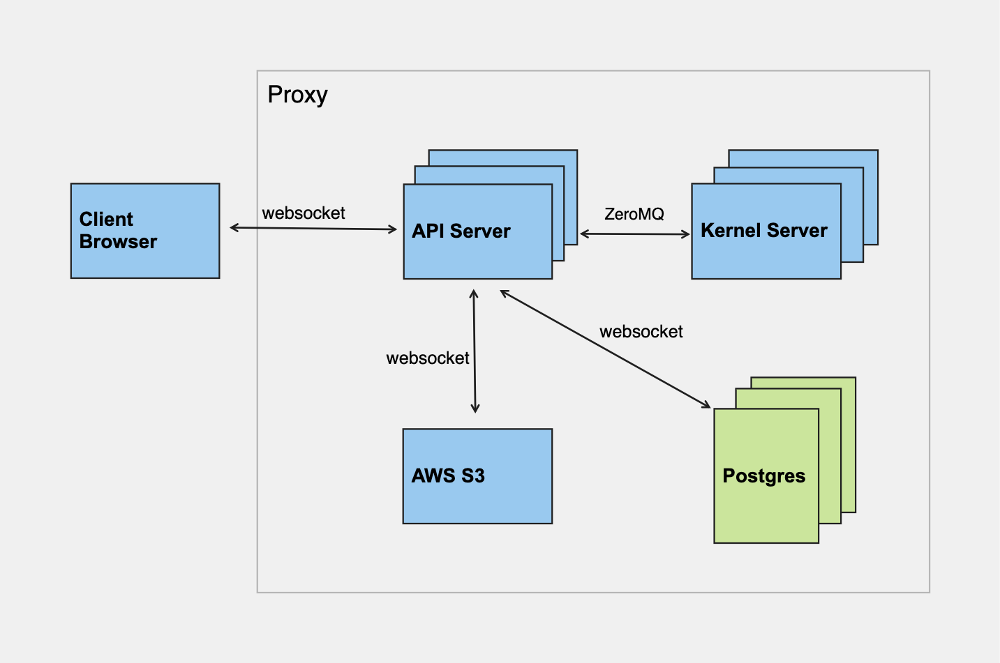

# Developer Manual

First clone CodePod:

```bash
git clone https://github.com/codepod-io/codepod.git
```

We use the variable `CODEPOD_ROOT` to refer to the root folder of the CodePod.
If you just ran the command above, then `CODEPOD_ROOT` is the folder you just cloned.

Now enter the `CODEPOD_ROOT/compose` folder:

```bash
cd codepod/compose
```

The docker compose files are in `CODEPOD_ROOT/compose/dev` folder. The `dev` stack mounts the
`src` folder, so that you can edit the files on your local computer, and let the
node.js process inside the container do the compiling and hot-reloading.

To install docker-compose, follow the official [Docker documentation](https://docs.docker.com/compose/install/linux/).

## .env file

Now enter the `CODEPOD_ROOT/compose/dev` folder and copy `.env.example` to `.env` file, and optionally change the settings.

## Starting the stack

From the `CODEPOD_ROOT/compose/dev` folder, first run:

```bash
docker compose up setup
```

This will invoke pnpm install to download `node_modules`, and initialize DB. The
`node_modules` will be installed locally to your host file-system, so that
error linting will work in your VSCode when you open source files.

Then fire up the stack:

```bash
docker compose up -d
```

Once the `ui` and `api` containers are ready, go to `http://localhost:8080` to
see the app.

### Database Schema Migration

If you are a developer who wants to change the database schema for adding a feature, you can update the schema file `CODEPOD_ROOT/api/prisma/schema.prisma` and then run the command in the `api` contianer:

```bash
# Be sure to run the command in the container!
docker exec -it dev-api-1 /bin/bash
# The command to migrate
pnpm dlx prisma migrate dev --name add_a_new_field
```

to generate a migration, like [this](https://github.com/codepod-io/codepod/blob/main/api/prisma/migrations/20230223102734_add_updated_at/migration.sql).
The schema change along with this migration need to be checked in (add, commit, and push) to git.

Once the DB schema is changed, other developers need to pull the changes, and
apply the migration by running the following command in the `api` container:

```bash
pnpm dlx prisma migrate dev
```

and then restart the `api` container to take effect of the new DB schema.

:::note
You can also use docker desktop or VSCode's docker plugin to attach a shell to the container.


:::

## Starting two stacks simultaneously

It might be necessary to create two Docker stacks for two verions of CodePod, respectively. For example, you might want to test the new version of CodePod while keeping the old version running.

Because Docker uses the folder name as the default suffix in container names, these two stacks may conflict with each other. To avoid this, you can use the `COMPOSE_PROJECT_NAME` environment variable to set a prefix for the container names. For example, you can set `COMPOSE_PROJECT_NAME=codepod-v2` in the `CODEPOD_ROOT/compose/dev/.env` file of the new stack, and then [start](#starting-the-stack) the new stack.

The two stacks also may share the same network ports due to the same configuration files used. To set the ports, search for the following lines in `CODEPOD_ROOT/compose/dev/nginx.conf` (two occurences of the two lines in the file) file of the new stack:

```yaml
listen 8080;
listen [::]:8080;
```

and the following section in the `CODEPOD_ROOT/compose/dev/compose.yml` file of the new stack:

```
  nginx:
    image: nginx:alpine
    ports:
      - 8080:8080
    volumes:
      - ./nginx.conf:/etc/nginx/conf.d/default.conf
```

and replace the default port number 8080 to a new port number. For example, you can set the port number to 8081 for all occurences of 8080.

Also, comment out the port section of the `ui` container in `CODEPOD_ROOT/compose/dev/compose.yml` as:

```
  ui:
    image: node:18
    working_dir: /app
#    ports:
      # For react hot-reloading in development.
#    - 3000:3000
```

Then, you can access the new stack at `http://localhost:8080`.

## Developer Onboarding

### Developing Language

[Typescript](https://github.com/microsoft/TypeScript)

### Libraries and Frameworks

- [React](https://react.dev/) framework
  - [Apollo GraphQL](https://www.apollographql.com/)
  - [Zustand](https://docs.pmnd.rs/zustand/getting-started/introduction) (scalable state management)
  - [Monaco](https://github.com/microsoft/monaco-editor) editor
  - [Remirror](https://github.com/remirror/remirror) rich-text editor
  - [Material](https://mui.com/core/) UI
  - [Nano ID](https://github.com/ai/nanoid/blob/HEAD/README.zh-CN.md) UUID generator
  - [Express](https://expressjs.com/)
- [Jupyter](https://jupyter-client.readthedocs.io/en/stable/messaging.html)
  - [ZeroMQ](https://github.com/zeromq/zeromq.js) Node.js bindings
- [Docker](https://docs.docker.com/compose/compose-file/)
- [Kubernetes](https://kubernetes.io/docs/concepts/overview/)
  - [Helm](https://github.com/helm/helm) Chart
- Proxy configuration: [NGINX](https://github.com/nginx/nginx)
- Database: [PostgreSQL](https://www.postgresql.org/) + [Prisma](https://github.com/prisma/prisma)

### Codepod System Architecture



### Codepod GitHub Repo

- Frontend

  - [Ui](https://github.com/codepod-io/codepod/tree/main/ui): root folder for Codepod client implementation, it contains the implementation of pod, [Canvas](https://github.com/codepod-io/codepod/blob/main/ui/src/components/Canvas.tsx) and [Scope](https://github.com/codepod-io/codepod/blob/main/ui/src/components/nodes/Scope.tsx)

- Backend
  - [Proxy](https://github.com/codepod-io/codepod/tree/main/proxy): reverse proxy server, it forwards/redirects client requests to proper servers in the backbone.
  - [Api](https://github.com/codepod-io/codepod/tree/main/api): the API server handles users’ actions on the Codepod client app, it authenticates users, persists the repo, scope and pod states to the Postgres database.
  - [Runtime](https://github.com/codepod-io/codepod/tree/main/runtime): Codepod runtime server, http://localhost:4020, this URL is used in the front-end runtime.js to connect to the runtime, it handles the code execution logic on various kernels, e.g., IPython.

### References

- A tutorial for React-based web application development, [WhatsApp-Clone-Tutorial](https://www.tortilla.academy/Urigo/WhatsApp-Clone-Tutorial/master/next/step/0)
- [Typescript Tutorial](https://github.com/xcatliu/typescript-tutorial)
